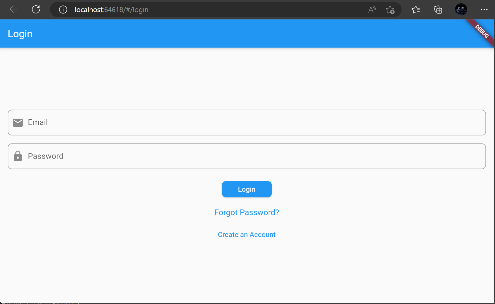

## Nama : Shobahus Solichin ##
## Nim : 312010076 ##
## KelaS : TI.20.A.1 ##

## Deskripsi UTS

Setelah mempelajari konsep dan teknik dalam pemrograman mobile dengan Flutter, tugas Anda adalah membuat halaman login yang responsif dan user-friendly. Halaman login ini akan digunakan untuk autentikasi pengguna dalam aplikasi.

## Fitur-fitur yang diimplementasikan

- Input field untuk memasukkan email
- Input field untuk memasukkan password (yang ditampilkan sebagai teks tersembunyi)
- Tombol "Login" untuk memulai proses autentikasi
- Tombol "Forgot Password?" untuk mengatur ulang kata sandi
- Tombol "Create an Account" untuk mendaftar ke akun baru

## Cara Menggunakan

Berikut adalah langkah-langkah untuk menggunakan aplikasi ini:

1. Buka project dalam editor Flutter yang telah diinstal di komputer Anda.
2. Jalankan aplikasi dengan perintah berikut:
   `flutter run`
3. Aplikasi akan terbuka di simulator atau perangkat yang Anda pilih. Anda dapat memasukkan email dan password untuk melakukan login, atau memilih opsi "Forgot Password?" untuk mengatur ulang kata sandi Anda. Jika Anda belum memiliki akun, Anda dapat memilih opsi "Create an Account" untuk mendaftar ke akun baru.

## Output

### Login

### Register

### Forgot Password

